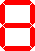
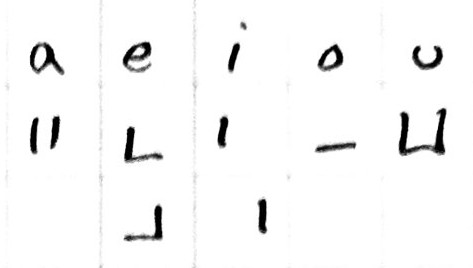

# 7-segment toki pona

## Goals
1. displayable on a 7-segment display
2. one syllable per character
3. writable by hand
4. reduce ambiguity in both writing and on a display
5. easy to remember
6. minimize strokes per character
7. include as much punctuation as possible for 7-segment displays

---
## a quick note
The summaries are presented at the top as a matter of convenience. I highly recommend reading the explanations that follow in order to understand how the system is put together. Rote memorization would require knowing 69 symbols while understanding the system only really requires 14 (+2 for the flipped variants).

---
## summary table
This table contains all viable variants of toki pona syllables

vowel | . | k | t | p | j | l | w | n | m | s
---   |---|---|---|---|---|---|---|---|---|---
. | | | | | | | |  |
a | |  |  |  |  |  |  |  |  | 
e (wan) | |  |  |  |  |  |  |  |  | 
e (tu) | |  |  |  |  |  |  |  |  | 
i (wan) | |  |  |  |  |  |  |  |  | 
i (tu) | |  | | |  |  |  |  |  | 
o | |  |  |  |  |  |  |  |  | 
u | |  |  |  |  |  |  |  |  | 

## Concept
The upper four segments on the display are used for the consonant and the lower three are used for the vowel in each syllable. The shapes of each are intentionally selected in an attempt to be unambiguous when written by hand or shown on a 7-segment display. I have included some handwriting examples below to help visualize what it looks like in that context.

Each syllable is to be written from top to bottom. The consonant is on the top and the vowel is on the bottom. This style of writing might flow better if written top-down rather than left-right, however I think either would be acceptable

## Vowels

The vowels take up the lower three bars of the seven segment display. This offers 2^3 potential variants of which the blank one is already taken by the `space` character. The remaining seven are _all_ used by the five vowels.

a | e | i | o | u
---|---|---|---|---
 |   |   |  | 

I tried to make them similar to the vowels in romanized languages, but it is somewhat minimal and abstract so you will have to bear with me. I provide as much justification as I can with each.

### a

Imagine the two side-bars of a capitalized "A". In _most_ of the consonants (e.g. "sa"), the center segment is active which helps with visualizing an "A" on the bottom

### e

Similar to "A", this benefits greatly from having a consonant. Sometimes it looks like a lowercase "e". This can be mirrored in order to reduce the number of strokes required to write the letter, especially in handwriting. Either is acceptable.

### i

Look it's a little "i"! It also can be mirrored like "e".

### o

This one never really looks like an "O" unfortunately. I remember it because "o" is very _open_ and this representation is the only vowel that is fully separated from all consonants.

### u

This one is likely the easiest to visualize. Although it has the opposite problem of "e" and "a" in that adding consonants can make it appear like an "o". It takes a little bit of focus at first to see beyond that, but I tried to make the combinations in a way that makes it flow smoothly once you are used to it.

## Consonants
sounds made in the back of the mouth are in the left column.

 back |mid |front
 ---|---|---
 k | t | p
 j | l | w
 . | n | m
 . | s | .

 back |mid |front
 ---|---|---
 |  | 
 |  | 
. |  | 
. |  | .

### k-t-p
k | t | p
---|---|---
 |  | 

- k looks like a "c" in the roman alphabet which can often make a "k" sound
- t looks like a "T" with the right half removed
- p looks like a "P" with the lower half of the lobe removed

### j-l-w
j | l | w
---|---|---
 |  | 

- j looks pretty much like a j without the dot
- l looks like an "L"
- w (double-u) looks like a single "u". (i.e. it's half of a "W")

### n-m
n | m
---|---
 | 

both of these characters block airflow and feel somewhat closed because all of the outer segments are filled. 
- n looks like the kanji for "ni" (2) in japanese: 二
- m looks like half of an "m" (it would have been cool to use this for n, but this shape wouldn't work because n and na would become ambiguous in handwriting)

### s

s is kinda its own thing in toki pona as a fricative consonant. I originally wanted to use this shape for a different consonant, but in the end s seemed the most appropriate to me. It's easy to remember because square starts with s.

## Avoiding Ambiguities
I wound up making about 4 iterations of this where I thought I had a great solution but wound up 

## handwritten summary table
almost all of these symbols can be written in 1 or 2 strokes (I am defining a stroke as having to lift your writing implement off the paper). There are only 2 symbols that require 3 strokes: wa, and no.

This table does not include all potential variants within this system, it is just what felt the most natural to me while writing since I feel like that is what would be preferred in general for a writing system.

## punctuation
period: 

quote: 

question: 

---
## Inspiration

- https://github.com/abalidoth/sitelen_palisa
- 7-segment images generated using GeoGachingToolbox.com under CC-by-nc-nd 3.0: https://www.geocachingtoolbox.com/index.php?lang=en&page=segmentDisplay